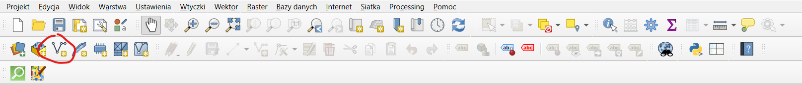

# Tworzenie do druku map topograficznych w QGIS w oparciu o OpenStreetMap

## Do poprawy / dopisania

- Siatka NATO (EPSG:326xx) **xx = strefa N**
- Precyzyjny dobór elementów dla mapy topograficznej

## > Program & Podstawowe ustawienia

### Lokalizacja (trzeba otworzyć ręcznie)

`C:\Program Files\QGIS 3.40.7\bin`

`qgis-ltr-bin.exe`

### Ogólne

### Układ Współrzędnych

`EPSG:2180 - ETRF2000-PL / CS92`

### XYZ Tiles

`Dodaj nowe połączenie`

**OpenTopoMap**: `https://tile.opentopomap.org/{z}/{x}/{y}.png`

**OpenStreetMap**: `https://tile.openstreetmap.org/{z}/{x}/{y}.png`

## > Mapa

### Stwórz warstwę

- Plik musi być umieszczony w miejscu dostępnym do zapisu dla QGIS

### Rysuj Poligon

Kliknij **prawym** po zakończeniu rysowania.

### QuickOSM

**Pobrane warstwy są tymczasowe, po zamknięciu QGIS zostaną utracone.**

## > Siatka

### Tworzenie siatki

### Odstępy

**A4 = 210mm x 297mm** = 0.21m x 0.297m (**pionowo ułożona kartka** - na wydruku odwrotnie interpretujemy wymiary)

W zalezności od skali. 

> Założmy 1:25 000.

**Poziom**: 0.297m x 25 000 = 7425m

**Pion**: 0.21m x 25 000 = 5250m

> Założmy 1:500

**Poziom**: 0.297m x 500 = 148.5m

**Pion**: 0.21m x 500 = 105m

## > Wydruk

### Wydruk

Ewentualnie:

### AtlasGrid

Zaznacz mapę i `Generuj Atlas`. 

`Kontrolowane przez Atlas` + `Margines 0%`

Sprawdź poprawność skali:

### Podziałka

### Położenie i rozmiar

`210 - 6 x 2 = 198mm`

`297 - 6 * 2 = 285mm`

**Odstęp siatki dla X i Y**:

`0,016666666667`

